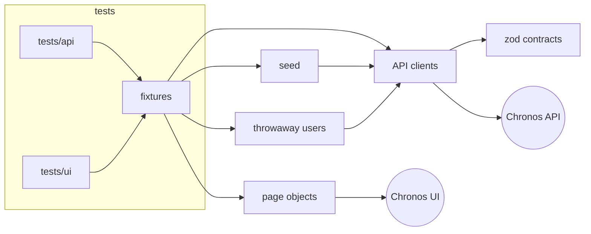

# Chronos autotests

[](https://github.com/raider20133/playwright-autotests/actions/workflows/daily-tests.yml)
[Latest Allure report](https://raider20133.github.io/playwright-autotests/latest/)

API and UI test automation for **Chronos**, a personal management app (checklist, leave requests,
service tracker, wish lists with sharing). React + MUI frontend, Express + PostgreSQL backend, both on Render.

**213 tests** per run: 132 API tests plus 27 UI tests in Chromium, Firefox and WebKit.
Every test is isolated: it registers its own user, runs, and deletes the user with all its data.
The suite runs in parallel and needs only one secret.

| Area | API | UI |
|---|---:|---:|
| Auth — login, registration, password reset | 11 | 6 |
| Security — auth on every route, forged tokens, cross-user access | 42 | – |
| Checklist — tasks, filters, month carryover | 23 | 10 |
| Leave requests | 13 | 7 |
| Service tracker and scheduled events | 12 | – |
| Wish lists and items | 13 | 4 |
| Wish list sharing (view-only access) | 6 | incl. above |
| Profile, settings, account deletion | 12 | – |

## Architecture



```
src/
  api/        typed clients per resource, HTTP wrapper, contract assertions
  schemas/    zod response contracts
  fixtures/   per-test users, API seeding, signed-in browser, page objects
  pages/      page objects (login, app shell, checklist, leave, wish list)
  users/      create and delete throwaway users
  data/       builders, dates, forged JWTs
  setup/      wakes the Render services, checks that user deletion is deployed
tests/
  api/        contract, validation, security and business-rule tests
  ui/         user flows, each checked against the API afterwards
```

## Design decisions

- **One throwaway user per test.** The `qaUser` fixture registers a fresh user
  (`qa_auto_<unique id>`) with the registration code and a random password, so no credentials
  are stored anywhere. After the test it deletes the user through `DELETE /api/users/me`. The
  database cascades the delete to every task, request, service and wish list the test created.
  Tests share nothing, so they run in any order and in parallel. Destructive flows ("delete
  all", "close month") never touch real data. Sharing tests get a second user (`peerUser`) the
  same way. If the API cannot delete users, global setup stops the run before any test starts,
  instead of leaving users behind.
- **Seed through the API, test through the UI.** UI tests create their data through the API,
  then drive only the behaviour under test in the browser. After a UI action, the test checks
  the API to confirm the change was actually saved.
- **Hand-written contracts.** Every response is validated with zod, including responses from
  seeding. A backend change that breaks the contract fails a test instead of passing silently.
- **Waiting for the network, not for time.** Page objects start listening for the API response
  before the click that triggers it. There are no `waitForTimeout` calls, and lint enforces it.
  Firefox and WebKit revalidate repeated GETs, so a GET wait also accepts `304`.
- **Known bugs are executable.** They are marked `test.fail()` with the reason. The run stays
  green, and the test flips to red as soon as someone fixes the bug, prompting the marker's removal.

## Bugs found

| # | Finding | Test |
|---|---|---|
| 1 | **IDOR:** any user can attach an event to another user's service (`POST /api/events` does not check ownership) | `security.spec.ts` |
| 2 | A negative price, an unsupported currency or an unknown type returns **500** instead of 400 (the DB CHECK constraint fails) | `tasks.spec.ts` |
| 3 | An unknown leave type returns **500** instead of 400 | `leave.spec.ts` |
| 4 | A leave request can end before it starts | `leave.spec.ts` |
| 5 | 500 responses expose raw PostgreSQL error messages to the client | seen in 2–3 |
| 6 | a11y: header icon buttons (settings, profile, logout) have no accessible name | `app-shell.ts` |
| 7 | Schema drift: `leave_requests.is_archived` is used by the API and UI but missing from the table definition, so a fresh database fails the yearly reset | `leave.spec.ts` |

## Running locally

```bash
npm ci
npx playwright install
cp .env.example .env        # set SECRET_PASSWORD (the registration code)
npm test                    # everything
npm run test:api            # API only (~20 s)
npm run test:smoke          # @smoke across projects
npx playwright test --project=chromium --ui
```

`npm run typecheck` and `npm run lint` run the same checks as CI (TypeScript strict and `eslint-plugin-playwright`).

## CI

`.github/workflows/daily-tests.yml` runs on every push and PR to `master`, and nightly.

1. **Typecheck and lint.**
2. **Tests** in a matrix: `api`, `chromium`, `firefox`, `webkit`. A failing test fails the job.
   Traces, videos and the HTML report are uploaded on failure.
3. **Report:**
   - merges the Allure results and keeps the trend history;
   - publishes the report to GitHub Pages (per run and `latest`);
   - writes a per-project summary to the job page;
   - posts it to Telegram.
4. **Cleanup:** removes reports older than 30 days.

Secrets: `BASE_URL`, `API_BASE_URL`, `SECRET_PASSWORD`, plus optional `GH_PAT`,
`TELEGRAM_TOKEN` and `TELEGRAM_CHAT_ID` for publishing.

`scripts/delete-legacy-qa-users.mjs` is a one-off script. It deletes the pooled `qa_auto_*`
users left behind by the previous version of the suite.
