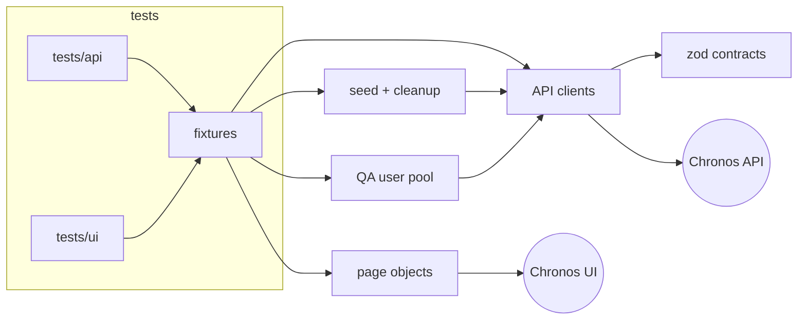

# Chronos autotests

[](https://github.com/raider20133/playwright-autotests/actions/workflows/daily-tests.yml)
[Latest Allure report](https://raider20133.github.io/playwright-autotests/latest/)

API and UI test automation for **Chronos**, a personal management app (checklist, leave requests,
service tracker, wish lists with sharing). React + MUI frontend, Express + PostgreSQL backend, both on Render.

**208 tests** per run: 127 API tests plus 27 UI tests in Chromium, Firefox and WebKit.
The suite runs in parallel, needs only one secret, and cleans up after itself.

| Area | API | UI |
|---|---:|---:|
| Auth — login, registration, password reset | 11 | 6 |
| Security — auth on every route, forged tokens, cross-user access | 41 | – |
| Checklist — tasks, filters, month carryover | 23 | 10 |
| Leave requests | 13 | 7 |
| Service tracker and scheduled events | 12 | – |
| Wish lists and items | 13 | 4 |
| Wish list sharing (view-only access) | 6 | incl. above |
| Profile and settings | 8 | – |

## Architecture



```
src/
  api/        typed clients per resource, HTTP wrapper, contract assertions
  schemas/    zod response contracts
  fixtures/   worker users, seed with auto-cleanup, signed-in browser, page objects
  pages/      page objects (login, app shell, checklist, leave, wish list)
  users/      self-provisioned QA users
  data/       builders, dates, forged JWTs, per-user purge
  setup/      global setup that wakes the Render services
tests/
  api/        contract, validation, security and business-rule tests
  ui/         user flows, each checked against the API afterwards
```

## Design decisions

- **Self-provisioned, isolated users.** Each project and parallel slot gets its own user
  (`qa_auto_chromium_owner_1`). The fixture registers it, or resets its password with the
  registration code if it already exists, and purges its data before the first test. So the
  suite needs no stored credentials, and destructive flows ("delete all", "close month") run
  in parallel without touching anyone else's data.
- **Seed through the API, test through the UI.** UI tests create their data through the API,
  then drive only the behaviour under test in the browser. After a UI action, the test checks
  the API to confirm the change was actually saved.
- **Undo stack cleanup.** Every seeded entity registers its own deletion, which runs in reverse
  order after the test. A failed cleanup is reported as an annotation. Leftovers are purged on
  the next run anyway.
- **Hand-written contracts.** Every response is validated with zod, including responses from
  seeding. A backend change that breaks the contract fails a test instead of passing silently.
- **Waiting for the network, not for time.** Page objects start listening for the API response
  before the click that triggers it. There are no `waitForTimeout` calls, and lint enforces it.
  Firefox and WebKit revalidate repeated GETs, so a GET wait also accepts `304`.
- **Known bugs are executable.** They are marked `test.fail()` with the reason. The run stays
  green, and the test flips to red as soon as someone fixes the bug, prompting the marker's removal.

## Bugs found

| # | Finding | Test |
|---|---|---|
| 1 | **IDOR:** any user can attach an event to another user's service (`POST /api/events` does not check ownership) | `security.spec.ts` |
| 2 | A negative price, an unsupported currency or an unknown type returns **500** instead of 400 (the DB CHECK constraint fails) | `tasks.spec.ts` |
| 3 | An unknown leave type returns **500** instead of 400 | `leave.spec.ts` |
| 4 | A leave request can end before it starts | `leave.spec.ts` |
| 5 | 500 responses expose raw PostgreSQL error messages to the client | seen in 2–3 |
| 6 | a11y: header icon buttons (settings, profile, logout) have no accessible name | `app-shell.ts` |

## Running locally

```bash
npm ci
npx playwright install
cp .env.example .env        # set REGISTRATION_CODE
npm test                    # everything
npm run test:api            # API only (~20 s)
npm run test:smoke          # @smoke across projects
npx playwright test --project=chromium --ui
```

`npm run typecheck` and `npm run lint` run the same checks as CI (TypeScript strict and `eslint-plugin-playwright`).

## CI

`.github/workflows/daily-tests.yml` runs on every push and PR to `master`, and nightly.

1. **Typecheck and lint.**
2. **Tests** in a matrix: `api`, `chromium`, `firefox`, `webkit`. A failing test fails the job.
   Traces, videos and the HTML report are uploaded on failure.
3. **Report:**
   - merges the Allure results and keeps the trend history;
   - publishes the report to GitHub Pages (per run and `latest`);
   - writes a per-project summary to the job page;
   - posts it to Telegram.
4. **Cleanup:** removes reports older than 30 days.

Secrets: `BASE_URL`, `API_BASE_URL`, `REGISTRATION_CODE` (or the legacy `SECRET_PASSWORD`),
plus optional `GH_PAT`, `TELEGRAM_TOKEN` and `TELEGRAM_CHAT_ID` for publishing.
